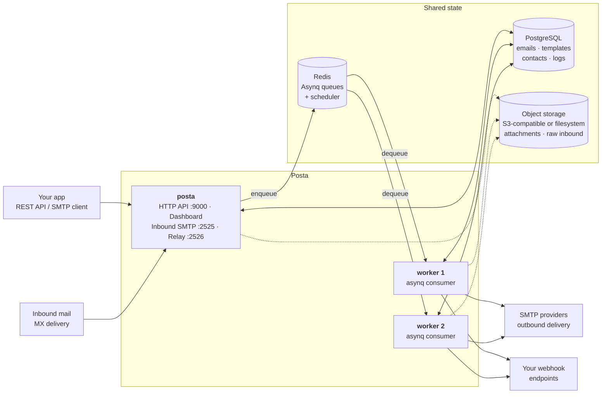

# Posta

<p align="center">
  
</p>

<p align="center">
  Self-hosted email delivery & inbound platform for developers and teams
</p>
<p align="center">
  <a href="#overview">Overview</a> ·
  <a href="#quick-start">Quick Start</a> ·
  <a href="#core-features">Features</a> ·
  <a href="#architecture">Architecture</a> ·
  <a href="#api-documentation">API</a> ·
  <a href="#dashboard">Dashboard</a> ·
  <a href="#official-sdks">SDKs</a> ·
  <a href="https://app.goposta.dev/">Live Demo</a> ·
  <a href="https://docs.goposta.dev/">Docs</a>
</p>

[](https://github.com/goposta/posta/actions/workflows/ci.yml)
[](https://go.dev/)
[](https://pkg.go.dev/github.com/goposta/posta)
[](https://github.com/goposta/posta/releases)


[](https://marketplace.miabi.io/templates/posta)


---

## Overview

**Posta** is a self-hosted, developer-first email platform that handles **outbound**, **inbound**, and **relayed** email — driven by a single HTTP API, with SMTP available for the paths that need it.

- **Outbound** — send transactional and marketing email over your own SMTP, with templates, localization, campaigns, subscriber lists, bounce and complaint handling, and delivery analytics.
- **Inbound** — receive email at your domains, parse messages and attachments, and forward the structured payloads to your application via webhooks.
- **Relay** — point an existing SMTP client at Posta and its mail flows through the same outbound pipeline as the API, so you can migrate to the HTTP API at your own pace.
- **Forms** — let a website contact form post straight to Posta, scan each submission for spam, and reply to the sender from the dashboard through the same domains and suppression list as everything else.

It is designed as a fully self-hostable alternative to services like SendGrid, Mailgun, and Postmark — giving you complete ownership of your email infrastructure, data, and deliverability.

[](https://www.goposta.dev/)
[](https://app.goposta.dev/)
[](https://github.com/goposta/posta)
---

## Quick Example

Send your first email:

```bash
curl -X POST http://localhost:9000/api/v1/emails/send \
  -H "Authorization: Bearer YOUR_API_KEY" \
  -H "Content-Type: application/json" \
  -d '{
    "from": "Acme <hello@example.com>",
    "to": ["Jonas Kaninda <jonas@example.com>","bob@example.com"],
    "subject": "Hello from Posta",
    "html": "<h1>Hello!</h1>"
  }'
```

> The `from`, `to`, and other address fields accept a plain address (`hello@example.com`)
> or RFC 5322 display-name format (`Acme <hello@example.com>`).

Response:

```json
{
  "id": "0ae4b04e-5c64-4b2f-bad6-460f8d5d98b3",
  "status": "queued"
}
```

Receive a website form submission — no JavaScript, no backend of your own:

```html
<form action="http://localhost:9000/api/v1/f/YOUR_FORM_KEY" method="POST">
  <input type="email" name="email" required>
  <textarea name="message" required></textarea>
  <button type="submit">Send</button>
</form>
```

The submission is scanned, stored, and shown in the dashboard, where a person
replies to the sender. There is no auto-responder.

---

## Core Features

### Email Delivery

* REST API for transactional, batch, and templated emails
* Attachments, custom headers, and unsubscribe support
* Web view ("view in browser") with signed, expiring links
* Scheduled sending and preview mode
* Email address verification (syntax, MX, disposable & role-account checks)
* Async processing with Redis and Asynq
* Automatic retries and priority queues

### Inbound Email

* Built-in SMTP receiver with TLS
* HTTP webhook ingest with HMAC verification
* Raw message, headers & attachment storage
* Forwarding with status tracking
* Spam scoring & retry on failure
* Real-time SSE stream for inbound notifications

### Web Form Messages

* Public ingest endpoint per form — `POST /api/v1/f/{key}`, no API key on the page
* Accepts plain HTML form posts, JSON, and multipart uploads; works without JavaScript
* Origin allowlist, honeypot field, single-use nonces, and per-IP, per-form, per-sender and per-workspace rate limits
* Spam scanning with a score, the reasons behind it, and an action ladder — allow, flag, quarantine, reject
* Workspace spam filters by keyword, phrase, regex, email, domain, or IP, with a dry-run before you commit
* Manual replies from the dashboard through the normal sending pipeline — no auto-responder
* Inbox states, assignment, attachments, and a live event stream
* Immediate, hourly, or daily digest notifications to the addresses each form nominates
* Off by default behind `POSTA_MESSAGES_ENABLED`

### Email Relay

* Point an existing SMTP client at Posta — no code changes
* Relays into the same pipeline as the send API
* Domain verification, suppression & rate limits still apply
* Workspace-scoped credentials with IP allowlist
* Instant revocation, no redeploy
* Off by default — built for private networks

### Templates

* Versioned and multi-language templates
* Drag-and-drop visual email builder, or a code editor with syntax highlighting and a live preview
* Variable substitution and stylesheet inlining
* System variables for web view and one-click unsubscribe links
* Import/export, HTML file import, and desktop/mobile preview

### Campaigns

* Bulk email campaigns with scheduling and subscriber targeting
* Draft, scheduled, sending, paused, and cancelled lifecycle states
* A/B testing with multi-variant splits and per-variant performance metrics

### SMTP & Domains

* Multiple SMTP providers with TLS support
* Shared SMTP pools for teams
* Domain verification (SPF, DKIM, DMARC)
* Verified sender enforcement

### Security

* API keys with expiration, hashing, and IP allowlisting
* JWT authentication and RBAC
* Two-factor authentication (TOTP)
* OAuth / SSO login (Google, Keycloak, authentik, and more)
* Rate limiting and session management

### Contacts & Subscribers

* Auto-tracked contacts with per-recipient send/failure stats
* Subscriber management with static and dynamic (segmented) lists
* Bulk import via JSON or CSV with column mapping
* Subscriber lifecycle (active, bounced, unsubscribed)
* Hard/soft bounce and complaint handling with automatic suppression

### Unsubscribe Lists

* RFC 8058 one-click unsubscribe scoped per list
* Posta-minted signed URLs and `List-Unsubscribe` header
* Scoped opt-outs so receipts and password resets keep flowing
* Management API and dashboard for CRUD and opt-out browsing
* `email.unsubscribed` webhook event
* Resubscribe individual addresses without lifting a global block

### Tracking

* Pixel-based open tracking
* Click tracking with link rewriting
* Per-email engagement metrics

### Workspaces

* Multi-tenant architecture with isolated workspaces
* Role-based access control (owner, admin, editor, viewer)
* Member invitations and scoped API keys
* Data export/import and GDPR contact/log deletion

### Webhooks & Events

* Event-driven architecture with webhook delivery
* Retry strategies and delivery tracking
* Audit logs and real-time event streaming

### Analytics & Monitoring

* Email delivery, open, and click metrics, compared against the preceding period
* Delivery and bounce trends, plus time-to-deliver percentiles
* Deliverability broken down by recipient mailbox provider — Gmail, Outlook, Yahoo, and the rest
* CSV export of any report
* Prometheus integration
* Health endpoints and daily reports

### Admin Platform

* User and API key management
* Platform dashboard, metrics, and logs
* Domains across every workspace, with a manual ownership override for the cases DNS cannot settle
* Announcements broadcast to every user's in-app inbox, retractable after the fact
* SMTP pool management
* Usage plans with quotas and per-workspace assignment
* OAuth/SSO provider configuration
* Platform configuration and retention policies

### Dashboard

* Vue-based UI for managing all resources
* Analytics, templates, SMTP, domains, contacts, campaigns, messages, and logs
* Per-user notification inbox with dismissible workspace health alerts
* Dark/light mode and user preferences

---

## Architecture

Posta ships as a single binary that runs in two modes: `posta` serves the HTTP API,
dashboard, and SMTP listeners; `posta worker` consumes the job queue. Both modes are
stateless — all state lives in the shared PostgreSQL, Redis, and object storage — so you
can run as many workers as your send volume needs.



Running the API without a dedicated worker works for evaluation, but production
deployments should split them so sending, retries, campaigns, and scheduled jobs scale
independently of request traffic — see
[`examples/docker-compose-full.yml`](examples/docker-compose-full.yml).

Object storage is optional (dashed above). With `POSTA_BLOB_PROVIDER` unset, attachments
and raw inbound messages stay in the database; point it at `s3` or `fs` to move them out.
Any multi-node deployment should use `s3` — a local `fs` path is not shared between the
server and its workers.

### Stack

* Backend: Go (Okapi framework)
* Frontend: Vue 3 + Vite
* Database: PostgreSQL
* Queue: Redis + Asynq
* Metrics: Prometheus

---

## Requirements

* Go 1.27+
* PostgreSQL
* Redis

---

## Quick Start

### Docker Compose

```bash
docker compose up -d
```

Access the dashboard:

```
http://localhost:9000
```

Default credentials:

```
Email: admin@example.com
Password: admin1234
```

---

### Local Development

```bash
git clone https://github.com/goposta/posta.git
cd posta

make dev-deps
make dev
make dev-worker
```

---

## API Documentation

Every Posta instance serves its own interactive API documentation:

* API Reference: `/docs` on your Posta instance
* OpenAPI Spec: `/openapi.json` on your Posta instance

Running locally with the default port, that is [http://localhost:9000/docs](http://localhost:9000/docs).
---

# Dashboard

Posta includes a web dashboard for managing templates, SMTP servers, domains, contacts, API keys, and analytics.

<p align="center">
  
</p>

### Email Analytics

<p align="center">
  
</p>

### Template Detail

<p align="center">
  
</p>

### Template Editor

<p align="center">
  
</p>

### Admin Platform Metrics

<p align="center">
  
</p>

### Admin Platform Metrics (Dark)

<p align="center">
  
</p>

---

## Managed Posta on Miabi

Posta is available in the **[Miabi Marketplace](https://marketplace.miabi.io/templates/posta)** as a ready-to-run template, deployed with a **dedicated worker** so queued sending, automatic retries, campaigns, and scheduled jobs work from the start.


[](https://marketplace.miabi.io/templates/posta)


This is still self-hosted Posta — your own instance, your data, the same AGPL-3.0 build. You just skip the setup: no Docker Compose to write, no services to wire together. Miabi deploys and manages it for you.

<p align="center">
  
</p>
---

## Official SDKs

* Go: [https://github.com/goposta/posta-go](https://github.com/goposta/posta-go)
* PHP: [https://github.com/goposta/posta-php](https://github.com/goposta/posta-php)
* Java: [https://github.com/goposta/posta-java](https://github.com/goposta/posta-java)
* .NET: [https://github.com/goposta/posta-dotnet](https://github.com/goposta/posta-dotnet)

### Go Example

```go
client := posta.New("https://posta.example.com", "your-api-key")

resp, err := client.SendEmail(&posta.SendEmailRequest{
    From:    "sender@example.com",
    To:      []string{"recipient@example.com"},
    Subject: "Hello from Posta",
    HTML:    "<h1>Hello!</h1>",
})
```

---

## Contributing

Contributions are welcome. Please open an issue before submitting a pull request.

---

## License

Posta is free and open-source software licensed under the
GNU Affero General Public License v3.0 or later ([AGPL-3.0-or-later](LICENSE)).

Commercial support and hosted Posta services may be offered separately.

## Copyright

Copyright (c) 2026 Jonas Kaninda and contributors
