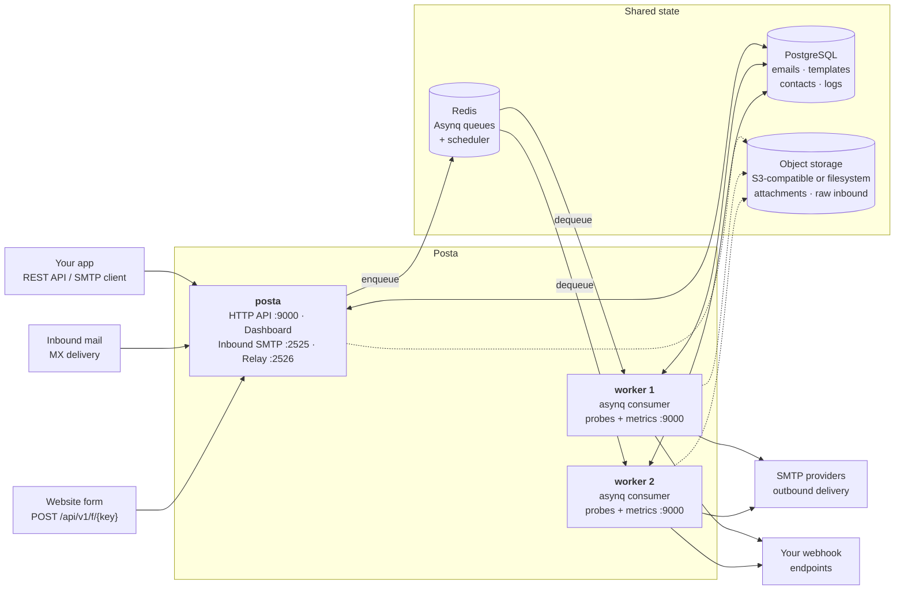

# Architecture

Posta ships as a **single binary that runs in two modes**. `posta` serves the
HTTP API, the dashboard, and the SMTP listeners; `posta worker` consumes the job
queue. Both are stateless — all state lives in PostgreSQL, Redis, and object
storage — so you can run as many workers as your send volume needs.



## The two processes

### `posta` — the server

Accepts work and answers questions. It never sends mail itself.

| Listener | Default port | Purpose |
|----------|--------------|---------|
| HTTP | `9000` | REST API, dashboard, web view, tracking pixels, form ingest |
| Inbound SMTP | `2525` | Receives mail delivered to your MX records |
| SMTP relay | `2526` | Accepts mail from an existing SMTP client |

Everything that takes time — delivery, retries, campaign batches, inbound
parsing, webhook fan-out — is written to PostgreSQL and enqueued in Redis. The
request returns as soon as the job is durable, which is why a send is answered in
milliseconds regardless of how slow the receiving mail server is.

### `posta worker` — the consumer

Pulls jobs off the queue and does the slow work: opening SMTP connections,
retrying failures, walking campaign recipient lists, parsing inbound messages,
delivering webhooks, and running scheduled jobs such as retention cleanup and
daily reports.

Workers are interchangeable. Adding one increases throughput; losing one leaves
its in-flight jobs to be retried by another.

## Running the worker

An embedded worker (`POSTA_EMBEDDED_WORKER=true`) is fine for evaluation and
small installs — one container, nothing else to run. Production deployments
should split them, so sending, retries, campaigns, and scheduled jobs scale
independently of request traffic and a burst of API calls cannot starve delivery.

See [`examples/docker-compose-full.yml`](https://github.com/goposta/posta/blob/main/examples/docker-compose-full.yml)
for a two-process deployment.

:::warning
Run **at least one** worker. With no worker and no embedded worker, the API
accepts sends and returns `queued` — and nothing ever delivers them. Everything
looks healthy while the queue grows.
:::

### Health and metrics

A dedicated worker serves the same probes as the server, on the same port
(`POSTA_PORT`, default `9000`). Server and worker run as separate containers, so
one port and one health check command cover both.

| Endpoint | Meaning |
|----------|---------|
| `/healthz` | The process is alive. Checks nothing else on purpose — a liveness probe that fails during a database blip gets the worker restarted, which loses in-flight work and does not fix the database. |
| `/readyz` | Dependencies are reachable **and** the worker is consuming. Returns `503` otherwise, so an orchestrator stops routing to a worker that has stopped processing. |
| `/metrics` | Prometheus exposition for this process. |

The image ships a health check that covers both roles:

```yaml
healthcheck:
  test: ["CMD", "posta-healthcheck"]
  interval: 30s
  timeout: 5s
  start_period: 10s
  retries: 3
```

Set `POSTA_WORKER_HEALTH_ENABLED=false` to disable the listener, or
`POSTA_WORKER_HEALTH_PORT` to move it.

## Shared state

| Store | Holds | Required |
|-------|-------|----------|
| **PostgreSQL** | Emails, templates, contacts, subscribers, campaigns, domains, logs, audit trail | Yes |
| **Redis** | Asynq queues, the scheduler, caches, rate-limit counters | Yes |
| **Object storage** | Attachments and raw inbound messages | No |

Object storage is optional. With `POSTA_BLOB_PROVIDER` unset, attachments and raw
inbound messages stay in the database.

:::caution
Any multi-node deployment should use `s3`. A local `fs` path is not shared
between the server and its workers, so a worker on another host cannot read an
attachment the server wrote.
:::

## Queues

Jobs are split across three Asynq queues so that a large campaign cannot delay a
password reset:

| Queue | Weight | Carries |
|-------|--------|---------|
| `transactional` | 6 | API and relayed sends, inbound parsing and forwarding, form messages |
| `bulk` | 3 | Campaign starts, campaign batches, and the individual campaign sends they produce |
| `low` | 1 | Per-workspace daily reports |

The weights are relative, not exclusive: a worker with nothing transactional to
do will happily process bulk. Scheduled maintenance such as retention cleanup
runs on the cron scheduler in-process rather than through a queue.

## Stack

- **Backend** — Go, using the [Okapi](https://github.com/jkaninda/okapi) web framework
- **Frontend** — Vue 3 + Vite, embedded into the binary
- **Database** — PostgreSQL
- **Queue** — Redis with [Asynq](https://github.com/hibiken/asynq)
- **Metrics** — Prometheus

## Next steps

- [Installation](/docs/getting-started/installation) — deploy with Docker or from source
- [Configuration](/docs/getting-started/configuration) — every environment variable
- [Quick Start](/docs/getting-started/quickstart) — send your first email
